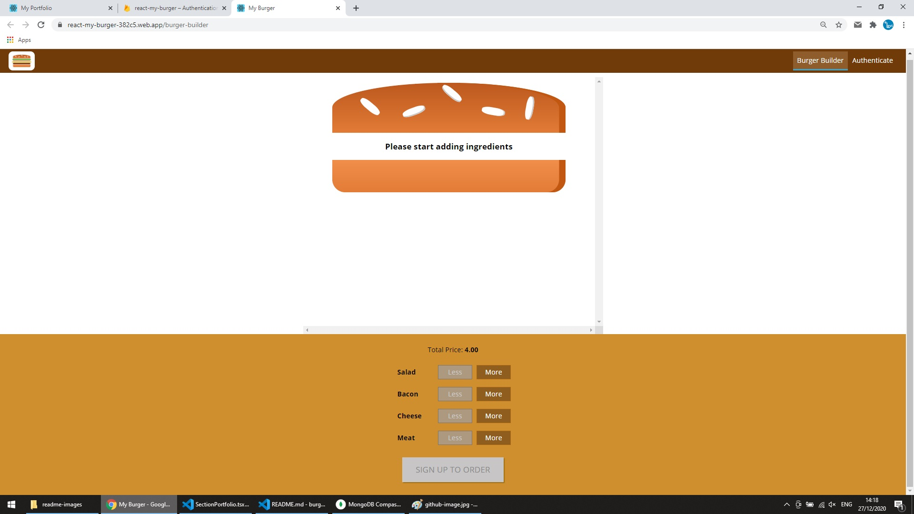
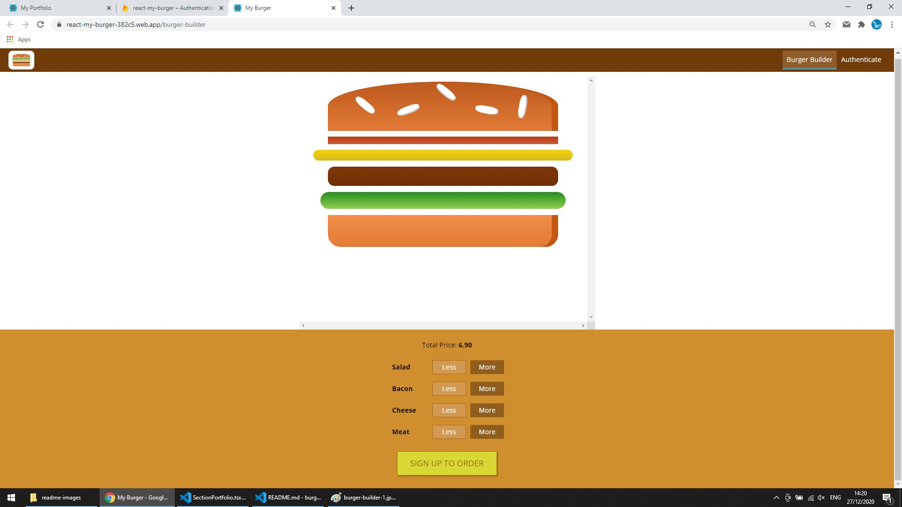
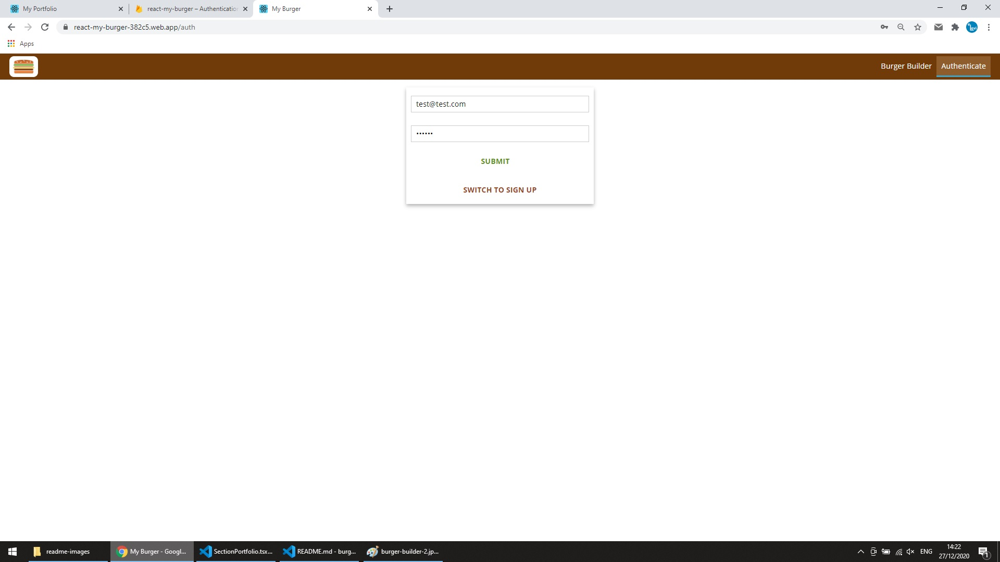
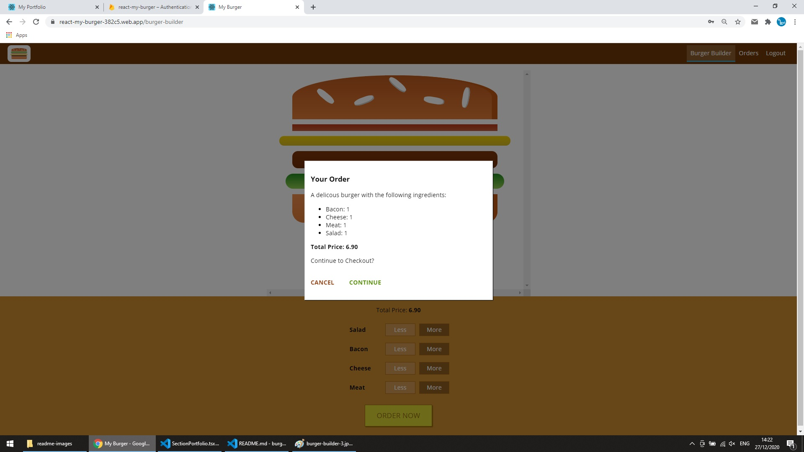
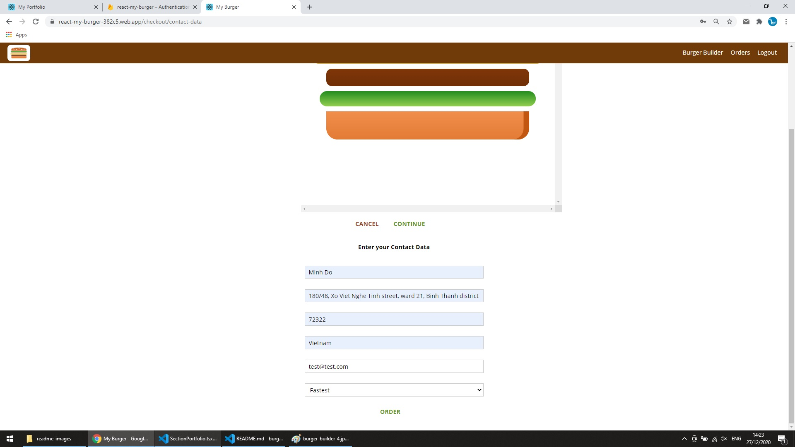
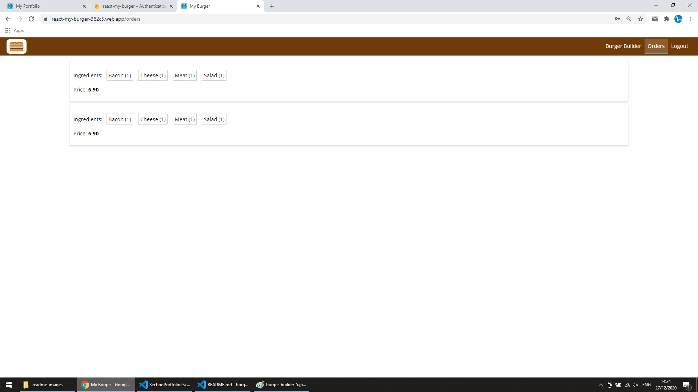

# Burger Builder

A project focusing on core features of ReactJS library: Hooks, Custom Hooks, Redux, Thunk, Saga, HOC.

https://react-my-burger-382c5.web.app/burger-builder

 

# Features

- Sign-in/ sign-up using firebase Authentication.
- Keep user logged-in with token, and auto log-out when expired.
- Only logged-in users can place orders.
- Load initial ingredients from firebase real-time database.
- Build a burger with ingredients from user choices.
- Submited orders will be stored in firebase real-time database.
- User can review all their orders.

 

## Screenshots

## 

## 

## 

## 

## 

## 
